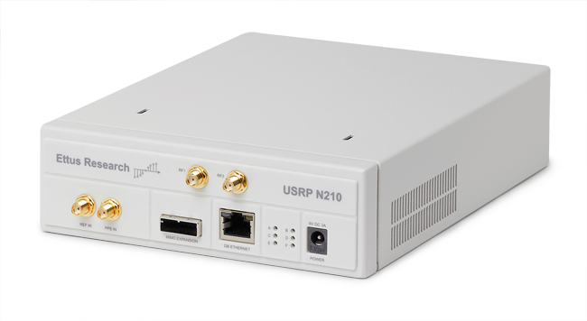

********
Hardware
********

This section describes the hardware side of the UFSC ground station and details the main peripherals that will be used in this project. Most of the components described here are represented in the block diagram.

Antennas
========

There are two antennas in the ground station: One for VHF and one for the UHF band. The main characteristics of these antennas can be seen in :numref:`tab:antennas`.

.. _tab:antennas:

.. list-table:: Main characteristics of the ground segment antennas.
   :name: Antennas
   :header-rows: 1
   :widths: 30 15 15

   * - **Characteristic**
     - **VHF Antenna**
     - **UHF Antenna**
   * - Brand
     - M²
     - Cushcraft
   * - Model
     - 2MCP14
     - A719B
   * - Type
     - Yagi
     - Yagi
   * - Number of elements
     - 14
     - 19
   * - Frequency range
     - 143-148 MHz
     - 430-450 MHz
   * - Gain
     - 12.34 dBi
     - 15.5 dBi
   * - Power rating
     - 1500 W
     - 2000 W
   * - Boom length
     - 3.2 m
     - 4.1 m
   * - Longest element
     - 1.02 m
     - 0.34 m
   * - Weight
     - 2.72 kg
     - 2.55 kg

More information about the VHF and UHF antennas can be found in :cite:`2mcp14` and :cite:`a719b` respectively.

Surge Protector
---------------

To protect the ground station electronics of possible atmospheric discharges in the outside components, two surge protectors will be used (one for each antenna). The gas surge protectors safely discharge/deflect up to 5000 A of peak current to earth without causing damage to an independent ground. This kind of device is installed near the antennas, in cascade with the RF cables.

For this project the model MFJ-270N will be used, and a picture of it can be seen in :numref:`fig:mfj-270n`.

.. _fig:mfj-270n:

.. figure:: img/mfj-270n.jpeg
      :width: 50%
      :align: center
      :alt: Surge protector.

      Fig. MFJ-270N surge protector.

Rotator
=======

Both antennas (VHF and UHF) track the satellite through a two-axis rotator (azimuth and elevation). The used model is the Yaesu G-5500, which provides 450\ :sup:`°` azimuth and 180\ :sup:`°` elevation control of medium and large-size unidirectional satellite antenna arrays under remote control from the station operation position.

A picture of the G-5500 rotator (and controller) can be seen in :numref:`fig:g5500`, and the main characteristics can be found in :numref:`tab:grs-rotor`.

.. _fig:g5500:

.. figure:: img/g5500.jpg
   :width: 60%
   :align: center

   Yaesu G-5500 rotator and controller.

.. _tab:grs-rotor:

.. list-table:: Main characteristics of antennas' rotators.
   :widths: 45 25
   :header-rows: 1

   * - **Characteristic**
     - **Value**
   * - Brand
     - Yaesu
   * - Model
     - G-5500
   * - Voltage requirement
     - 110-120 or 200-240 V\ :sub:`AC`
   * - Motor voltage
     - 24 V\ :sub:`AC`
   * - Rotation time (elevation, 180\ :sup:`°`)
     - 67 sec
   * - Rotation time (azimuth, 360\ :sup:`°`)
     - 58 sec
   * - Maximum continuous operation
     - 5 min
   * - Rotation torque (elevation)
     - 14 kg·m
   * - Rotation torque (azimuth)
     - 6 kg·m
   * - Braking torque (elevation and azimuth)
     - 40 kg·m
   * - Vertical load
     - 200 kg
   * - Pointing accuracy
     - ±4 %
   * - Wind surface area
     - 1 m\ :sup:`2`
   * - Weight (rotator)
     - 9 kg
   * - Weight (controller)
     - 3 kg

More information about the ground station rotator can be found in :cite:`g5500`.

Amplifiers
==========

Power Amplifiers (VHF/UHF)
--------------------------

A picture of the power amplifier can be seen in :numref:`fig:zhl-50w`, and the main characteristics are available in :numref:`tab:zhl-50w-specs`.

.. _fig:zhl-50w:

.. figure:: img/zhl-50w.png
   :width: 30%
   :align: center

   Mini-Circuits ZHL-50W-52-S+ power amplifier.

.. _tab:zhl-50w-specs:

.. list-table:: Main characteristics of the ZHL-50W-52-S+ power amplifier.
   :widths: 40 30
   :header-rows: 1

   * - **Characteristic**
     - **Value**
   * - Brand
     - Mini-Circuits
   * - Model
     - ZHL-50W-52-S+
   * - Frequency range
     - 50-500 MHz
   * - Gain
     - 47-52 dB
   * - Noise figure
     - 4.5-7.0 dB
   * - DC supply voltage
     - 24-25 V
   * - Max. supply current
     - 9.3 A

Power Amplifiers (S-Band)
--------------------------

.. note::
    TODO

Low-Noise Amplifier
-------------------

.. note::
    TODO

Software Defined Radio
----------------------

As presented in :numref:`fig:grs-block-diagram`, the ground segment also has three SDR transceivers. The deployed model is the USRP N210 from Ettus Research :cite:`n210`, a high-performance, networked software-defined radio platform. Unlike single-board designs with integrated RFICs (e.g., AD9361), the N210 features a modular architecture with:

- **Frequency coverage**: DC to 6 GHz (via interchangeable daughterboards like SBX/WBX).
- **FPGA processing**: Xilinx Spartan 3A-DSP 1800 for customizable signal processing.
- **Host connectivity**: Gigabit Ethernet (1 GbE) for high-throughput streaming.
- **Synchronization**: 10 MHz reference clock and PPS input for multi-unit coordination.

The platform supports the USRP Hardware Driver (UHD), enabling seamless integration with GNURadio and other SDR frameworks. A picture of the USRP N210 SDR (with enclosure) can be seen in :numref:`fig:usrp-n210`.

.. _fig:usrp-n210:

   Ettus USRP N210 SDR.

The :numref:`tab:n210-specs` lists the key hardware specifications of the USRP N210 SDR.

.. _tab:n210-specs:

.. list-table:: USRP N210 Hardware Specifications
   :widths: 30 70
   :header-rows: 1
   :class: longtable

   * - **Category**
     - **Specification**
   * - **RF Performance**
     -
   * - Frequency Range
     - DC – 6 GHz (with compatible daughterboard)
   * - Maximum Bandwidth
     - 50 MHz (25 MHz usable in practice)
   * - ADC Resolution
     - 14-bit
   * - DAC Resolution
     - 16-bit
   * - **Processing & Connectivity**
     -
   * - FPGA
     - Xilinx Spartan 3A-DSP 1800
   * - Host Interface
     - Gigabit Ethernet (1 GbE)
   * - Sample Rate (Complex)
     - Up to 100 MS/s
   * - **Synchronization**
     -
   * - Reference Clock Input
     - 10 MHz (external)
   * - PPS Input
     - Yes (for timing synchronization)
   * - **Expansion & Power**
     -
   * - Daughterboard Slots
     - 2 (supports SBX, WBX, etc.)
   * - MIMO Capability
     - Yes (2x2 with secondary USRP)
   * - Power Supply
     - 6–12 V DC (9–12 V recommended)
