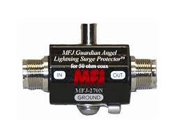

********
Hardware
********

This section describes the hardware side of the UFSC ground station and details the main peripherals that will be used in this project. Most of the components described here are represented in the block diagram.

Antennas
========

There are two antennas in the ground station: One for VHF and one for the UHF band. The main characteristics of these antennas can be seen in :numref:`tab:antennas`.

.. _tab:antennas:

.. list-table:: Main characteristics of the ground segment antennas.
   :name: Antennas
   :header-rows: 1
   :widths: 30 15 15

   * - **Characteristic**
     - **VHF Antenna**
     - **UHF Antenna**
   * - Brand
     - M²
     - Cushcraft
   * - Model
     - 2MCP14
     - A719B
   * - Type
     - Yagi
     - Yagi
   * - Number of elements
     - 14
     - 19
   * - Frequency range
     - 143-148 MHz
     - 430-450 MHz
   * - Gain
     - 12.34 dBi
     - 15.5 dBi
   * - Power rating
     - 1500 W
     - 2000 W
   * - Boom length
     - 3.2 m
     - 4.1 m
   * - Longest element
     - 1.02 m
     - 0.34 m
   * - Weight
     - 2.72 kg
     - 2.55 kg

More information about the VHF and UHF antennas can be found in :cite:`2mcp14` and :cite:`a719b` respectively.

Surge Protector
---------------

To protect the ground station electronics of possible atmospheric discharges in the outside components, two surge protectors will be used (one for each antenna). The gas surge protectors safely discharge/deflect up to 5000 A of peak current to earth without causing damage to an independent ground. This kind of device is installed near the antennas, in cascade with the RF cables.

For this project the model MFJ-270N will be used, and a picture of it can be seen in :numref:`fig:mfj-270n`.

.. _fig:mfj-270n:

      Fig. MFJ-270N surge protector.

Rotator
=======

Both antennas (VHF and UHF) track the satellite through a two-axis rotator (azimuth and elevation). The used model is the Yaesu G-5500, which provides 450\ :sup:`°` azimuth and 180\ :sup:`°` elevation control of medium and large-size unidirectional satellite antenna arrays under remote control from the station operation position.

A picture of the G-5500 rotator (and controller) can be seen in :numref:`fig:g5500`, and the main characteristics can be found in :numref:`tab:grs-rotor`.

.. _fig:g5500:

.. figure:: img/g5500.jpg
   :width: 60%
   :align: center

   Yaesu G-5500 rotator and controller.

.. _tab:grs-rotor:

.. list-table:: Main characteristics of antennas' rotators.
   :widths: 45 25
   :header-rows: 1

   * - **Characteristic**
     - **Value**
   * - Brand
     - Yaesu
   * - Model
     - G-5500
   * - Voltage requirement
     - 110-120 or 200-240 V\ :sub:`AC`
   * - Motor voltage
     - 24 V\ :sub:`AC`
   * - Rotation time (elevation, 180\ :sup:`°`)
     - 67 sec
   * - Rotation time (azimuth, 360\ :sup:`°`)
     - 58 sec
   * - Maximum continuous operation
     - 5 min
   * - Rotation torque (elevation)
     - 14 kg·m
   * - Rotation torque (azimuth)
     - 6 kg·m
   * - Braking torque (elevation and azimuth)
     - 40 kg·m
   * - Vertical load
     - 200 kg
   * - Pointing accuracy
     - ±4 %
   * - Wind surface area
     - 1 m\ :sup:`2`
   * - Weight (rotator)
     - 9 kg
   * - Weight (controller)
     - 3 kg

More information about the ground station rotator can be found in :cite:`g5500`.

Amplifiers
==========

Power Amplifier
---------------

A picture of the power amplifier can be seen in :numref:`fig:zhl-50w`, and the main characteristics are available in :numref:`tab:zhl-50w-specs`.

.. _fig:zhl-50w:

   Mini-Circuits ZHL-50W-52-S+ power amplifier.

.. _tab:zhl-50w-specs:

.. list-table:: Main characteristics of the ZHL-50W-52-S+ power amplifier.
   :widths: 40 30
   :header-rows: 1

   * - **Characteristic**
     - **Value**
   * - Brand
     - Mini-Circuits
   * - Model
     - ZHL-50W-52-S+
   * - Frequency range
     - 50-500 MHz
   * - Gain
     - 47-52 dB
   * - Noise figure
     - 4.5-7.0 dB
   * - DC supply voltage
     - 24-25 V
   * - Max. supply current
     - 9.3 A

Low-Noise Amplifier
-------------------

Radio
=====

The Icom IC-9700 :cite:`ic9700` is an RF direct sampling receiver for 2 m and 70 cm. The IF receiver consists of a single, down conversion for 23 cm that is between 311 and 371 MHz. The PA provides 100 W on 2 m, 75 W on 70 cm, and 10 W on 23 cm.

In addition to band-specific memory channels, the IC-9700 allows band-specific receiver and transmitter settings. For transmit, users can make adjustments to RF power, TX power Limit, Limit Power, and TX Delay by band. Basic receiver settings, like the Noise Blanker, Noise Reduction, and others can be tweaked by band with a dynamic Notch and Filter setup by band/mode.

A picture of the IC-9700 radio can be seen in :numref:`fig:ic9700`.

.. _fig:ic9700:

.. figure:: img/ic-9700.jpg
   :width: 70%
   :align: center

   Icom IC-9700 radio transceiver.

Software Defined Radio
----------------------

As presented in :numref:`fig:grs-block-diagram`, the ground segment also has an SDR as transceiver. The used model is the USRP B210, from Ettus Research :cite:`b210`, which is a fully integrated, single-board SDR with continuous frequency coverage from 70 MHz to 6 GHz. It combines the AD9361 RFIC direct-conversion transceiver providing up to 56 MHz of real-time bandwidth, an open and reprogrammable Spartan6 FPGA, and USB 3.0 connectivity. Also, a full support for the USRP Hardware Driver (UHD) software allows the use with the GNURadio framework.

A picture of the USRP B210 SDR (with enclosure) can be seen in :numref:`fig:usrp-b210`.

.. _fig:usrp-b210:

   Ettus USRP B210 SDR.
