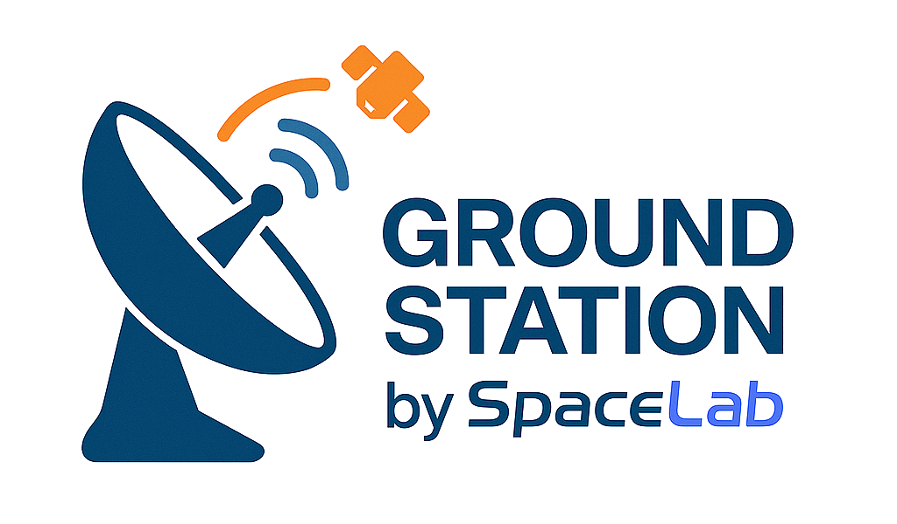

.. grs-doc documentation master file, created by
   sphinx-quickstart on Wed May  7 19:50:12 2025.
   You can adapt this file completely to your liking, but it should at least
   contain the root `toctree` directive.

=======================
SpaceLab Ground Station
=======================

This documentation provides a comprehensive overview of the UFSC ground station developed by SpaceLab, detailing its architecture, components, and operational capabilities. Designed to support ongoing satellite missions, the ground station features a robust and flexible system for reliable signal transmission and reception across multiple frequency bands. It's key features are:

* **Multi-band antenna systems** (VHF, UHF, S-Band) mounted on an azimuth/elevation rotor for precise satellite tracking.
* **Integrated protection and amplification** with surge protectors, LNAs, and PAs to ensure signal integrity.
* **Software Defined Radios (SDRs)** for versatile signal processing.
* **Remote operation and monitoring** via a central server.

Explore the sections below to learn more about how the station works, its technical specifications and capabilities.

.. toctree::
   :maxdepth: 3

   overview
   hardware
   software
   ctrl-room
   references

For any questions or further details, refer to the relevant documentation or contact the SpaceLab team at `contact@spacelab.ufsc.br <mailto:contact@spacelab.ufsc.br>`_.
