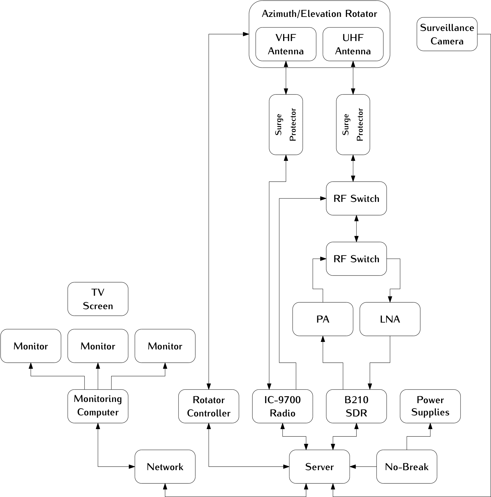

########
Overview 
########

The UFSC ground station is currently being developed and prepared for current ongoing missions of the group. A general block diagram can be seen in :numref:`fig:grs-block-diagram`.

.. _fig:grs-block-diagram:

      Fig. General block diagram.

The system is built to ensure robust signal transmission and reception, with integrated components for amplification, protection, and control.

At the core of the setup are three antenna systems, each dedicated to a specific frequency band: VHF, UHF, and S-Band. These antennas are mounted on an azimuth/elevation rotor, allowing precise directional control to track satellites as they move across the sky. Each antenna is connected to a surge protector to safeguard the equipment from voltage spikes, followed by an RF switch that enables seamless switching between transmission and reception modes.

For signal processing, the ground station employs an Software Defined Radio (SDR) for each frequency band. The received signals are amplified by Low-Noise Amplifiers (LNAs) to enhance sensitivity, while Power Amplifiers (PAs) boost outgoing signals for transmission. This dual amplification ensures efficient communication in both directions.

The rotator controller manages the antenna positioning, ensuring accurate alignment with satellites. A network switch connects all components to a central server, facilitating data processing, storage, and remote operation. Power supplies and a no-break system provide uninterrupted power, critical for maintaining continuous operation. Additionally, a surveillance camera is included for monitoring the movement of the antennas remotelly.

Overall, this ground station is a versatile and resilient system, capable of supporting a wide range of satellite communication tasks with high reliability and flexibility.
