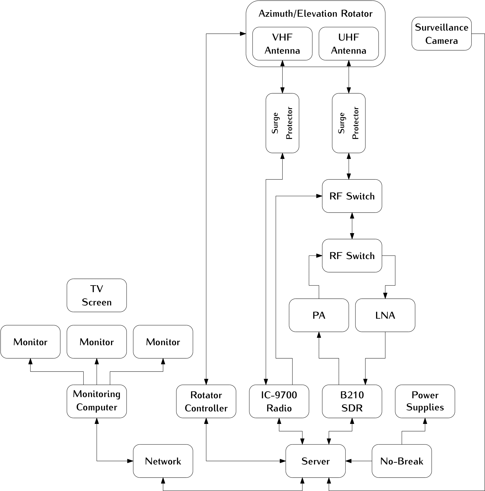

.. overview.rst

   Copyright The Ground Station Contributors.

   Ground Station Documentation

   This work is licensed under the Creative Commons Attribution-ShareAlike 4.0
   International License. To view a copy of this license,
   visit http://creativecommons.org/licenses/by-sa/4.0/.

********
Overview 
********

The SpaceLab ground station is currently being developed and prepared for current ongoing missions of the group. A general block diagram can be seen in :numref:`fig:grs-block-diagram`.

.. _fig:grs-block-diagram:

      General block diagram.

The system is built to ensure robust signal transmission and reception, with integrated components for amplification, protection, and control.

At the core of the setup are three antenna systems, each dedicated to a specific frequency band: VHF, UHF, and S-Band. These antennas are mounted on an azimuth/elevation rotor, allowing precise directional control to track satellites as they move across the sky. Each antenna is connected to a surge protector to safeguard the equipment from voltage spikes, followed by an RF switch that enables seamless switching between transmission and reception modes.

For signal processing, the ground station employs an Software Defined Radio (SDR) for each frequency band. The received signals are amplified by Low-Noise Amplifiers (LNAs) to enhance sensitivity, while Power Amplifiers (PAs) boost outgoing signals for transmission. This dual amplification ensures efficient communication in both directions.

The rotator controller manages the antenna positioning, ensuring accurate alignment with satellites. A network switch connects all components to a central server, facilitating data processing, storage, and remote operation. Power supplies and a no-break system provide uninterrupted power, critical for maintaining continuous operation. Additionally, a surveillance camera is included for monitoring the movement of the antennas remotelly.

Overall, this ground station is a versatile and resilient system, capable of supporting a wide range of satellite communication tasks with high reliability and flexibility.

Capabilities
============

The ground station was designed to support telemetry, telecommand, tracking, and payload data reception for CubeSats and small satellite missions operating in Low Earth Orbit (LEO). The system combines Software Defined Radio (SDR) technology, high-gain directional antennas, distributed signal processing software, and automated antenna tracking to provide a flexible and scalable communication infrastructure. The station supports simultaneous development, testing, and operation of multiple satellite missions while maintaining compatibility with a wide range of communication protocols and modulation schemes.

:numref:`tab:ground-station-capabilities` summarizes the main operational and technical capabilities of the ground station.

.. _tab:ground-station-capabilities:

.. list-table:: Main ground station capabilities
    :name: Capabilities
    :widths: 40 60
    :header-rows: 1

    * - **Parameter**
      - **Specification**
    * - Supported Frequency Bands
      - VHF, UHF, and S-Band
    * - VHF Frequency Range
      - 143 -- 148 MHz
    * - UHF Frequency Ranges
      - 398 -- 408 MHz and 462 -- 470 MHz
    * - S-Band Support
      - Planned
    * - SDR Platform
      - Ettus USRP N210
    * - SDR Frequency Coverage
      - DC -- 6 GHz
    * - Maximum Instantaneous Bandwidth
      - 50 MHz
    * - Maximum Complex Sample Rate
      - 100 MS/s
    * - ADC Resolution
      - 14-bit
    * - DAC Resolution
      - 16-bit
    * - VHF Antenna Gain
      - 12.34 dBi
    * - UHF Antenna Gain (400 MHz)
      - 14 dBi
    * - UHF Antenna Gain (468 MHz)
      - 19 dBi
    * - Power Amplifier Frequency Range
      - 50 -- 500 MHz
    * - PA Gain
      - 47 -- 52 dB
    * - LNA Frequency Range
      - 0.1 -- 500 MHz
    * - LNA Gain
      - 24 dB (minimum)
    * - LNA Noise Figure
      - 2.9 dB
    * - Antenna Tracking
      - Automatic azimuth/elevation control
    * - Rotator Pointing Accuracy
      - Approximately 1°
    * - Supported Modulations
      - GMSK, with extensibility for BPSK, QPSK, FSK, and AFSK
    * - Signal Processing Features
      - FFT, Doppler correction, syncword detection, SDR demodulation
    * - Database System
      - PostgreSQL + TimescaleDB
    * - Orbit Tracking Software
      - GPredict

The ground segment currently supports operations in the VHF, UHF, and S-Band frequency ranges. The VHF subsystem operates between 143 MHz and 148 MHz using a 14-element M2 2MCP14 Yagi antenna with a gain of 12.34 dBi. The UHF subsystem includes two independent antennas covering the 398--408 MHz and 462--470 MHz bands, providing gains of 14 dBi and 19 dBi respectively. An additional S-Band subsystem is planned for high-rate payload downlink operations.

For transmission, the ground station employs Mini-Circuits ZHL-50W-52-S+ power amplifiers in the VHF and UHF bands. These amplifiers provide operation from 50 MHz to 500 MHz with gains between 47 dB and 52 dB, enabling high-power uplink capability for satellite telecommands. Combined with the high-gain antenna systems, the station is capable of establishing reliable communication links with satellites in low Earth orbit under low elevation and weak signal conditions.

The reception chain includes dedicated low-noise amplifiers (LNAs) based on the Mini-Circuits ZFL-500LN+ platform. These LNAs operate from 0.1 MHz to 500 MHz with a noise figure of approximately 2.9 dB and a minimum gain of 24 dB. The low receiver noise figure significantly improves system sensitivity and enables the detection of low-power satellite transmissions, including CubeSat beacon signals and narrowband telemetry channels. Combined with the SDR front-end and digital signal processing pipeline, the station provides high sensitivity for weak-signal reception scenarios.

The SDR subsystem is based on the Ettus Research USRP N210 platform, providing wideband and fully programmable RF capabilities. The SDR infrastructure supports frequency coverage from DC to 6 GHz through interchangeable daughterboards, with up to 50 MHz instantaneous bandwidth and complex sample rates of up to 100 MS/s. The use of SDR technology enables the ground station to dynamically adapt to different satellite communication standards, protocols, and modulation schemes without requiring hardware modifications.

The digital signal processing chain implemented in the Station Server supports real-time IQ acquisition, FFT spectrum analysis, automatic Doppler correction, synchronization word detection, and software-based demodulation. The current implementation includes a complete GMSK demodulation pipeline with Gaussian matched filtering, timing recovery, and hard-decision bit recovery. Due to the SDR-based architecture, the system can also be extended to support additional modulation schemes such as BPSK, QPSK, FSK, AFSK, and other custom satellite waveforms.

The antenna positioning system uses a Hy-Gain RAS-2 azimuth/elevation rotator capable of full 360° azimuth rotation and high-precision satellite tracking with approximately 1° pointing accuracy. Satellite orbit prediction and pass tracking are performed using the GPredict software integrated into the ground station control system, allowing automatic antenna steering and real-time Doppler compensation during satellite passes.

The software architecture adopts a distributed microservice-oriented design based on ZeroMQ messaging middleware, allowing scalable deployment across multiple computers and displays. The system includes real-time spectrum monitoring, telemetry decoding, telecommand generation, database storage, mission dashboards, and automated station management services. This modular approach enables the ground station to support multiple simultaneous missions, simplifies future expansions, and facilitates integration with new satellite protocols and payloads.

Overall, the proposed ground station provides a flexible and robust infrastructure for satellite communication, telemetry reception, telecommand uplink, orbit tracking, payload experimentation, and mission operations. Its combination of SDR technology, high-gain antennas, automated tracking, and distributed software processing makes it suitable for academic, scientific, and experimental satellite missions, including CubeSats, IoT satellites, and Earth observation platforms.

Equipment
=========

A list with the main equipment of the station is available in :numref:`tab:equipment`.

.. _tab:equipment:

.. list-table:: List of equipment.
   :name: Equipment
   :header-rows: 1
   :widths: 30 15 15

   * - **Device**
     - **Brand**
     - **Model**
   * - Server
     - Dell
     - R240
   * - Nobreak
     - SMS
     - TBC
   * - Rotor
     - MFJ
     - RAS-2 SF 38
   * - VHF Antenna
     - M²
     - 2MCP14
   * - UHF Antenna (400 MHz)
     - M²
     - 403CP20
   * - UHF Antenna (468 MHz)
     - M²
     - 466CP42
   * - S-Band Antenna
     - TBD
     - TBD
   * - Surge Protector
     - MFJ
     - MFJ-270N
   * - RF Switch
     - TBC
     - TBC
   * - PA (VHF)
     - Mini-Circuits
     - ZHL-50W-52-S+
   * - PA (UHF)
     - Mini-Circuits
     - ZHL-50W-52-S+
   * - LNA (VHF)
     - Mini-Circuits
     - ZFL-500LN+
   * - LNA (UHF)
     - Mini-Circuits
     - ZFL-500LN+
   * - LNA (S-Band)
     - TBD
     - TBD
   * - SDR
     - Ettus
     - USRP N210
   * - Rotator Controller
     - AlfaSpid
     - Rot2Prog
   * - Surveillance Camera
     - Intelbras
     - GRS iM7S
   * - Network Switch
     - Tp-Link
     - TL-SG2218
   * - RF Front-End Controller
     - SpaceLab
     - Custom
   * - Power Supply (24 V)
     - Montel Telecom
     - MTAC2430B
