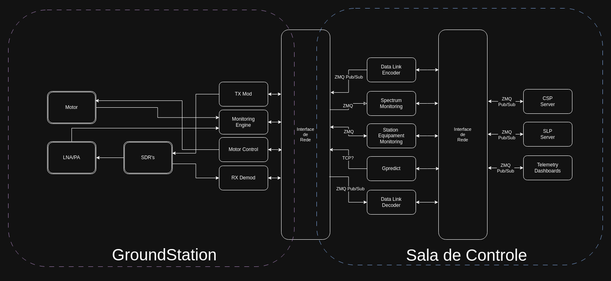

********
Software
********

Software Architecture
=====================
.. _fig:software-diagram:

   Ground station software diagram.

Satellite Tracking
==================

To track the satellite and for orbit prediction, the GPredict software :cite:`gpredict` will be used. Gpredict is a real-time satellite tracking and orbit prediction application. It can track a large number of satellites and display their position and other data in lists, tables, maps, and polar plots (radar view). Gpredict can also predict the time of future passes for a satellite, and provide you with detailed information about each pass. Gpredict is free software licensed under the GNU General Public License. A picture of the main window of GPredict can be seen in :numref:`fig:gpredict`.

.. _fig:gpredict:

.. figure:: img/gpredict.png
   :width: 100%
   :align: center

   Main window of GPredict.
