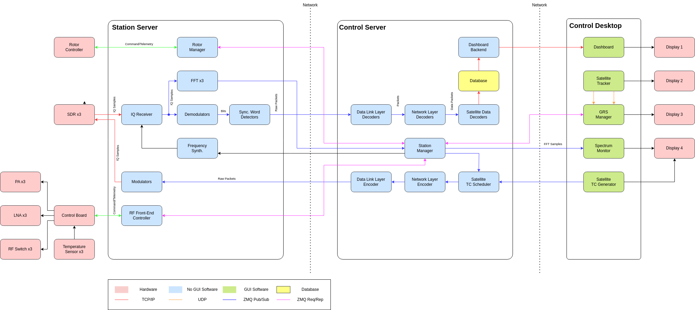
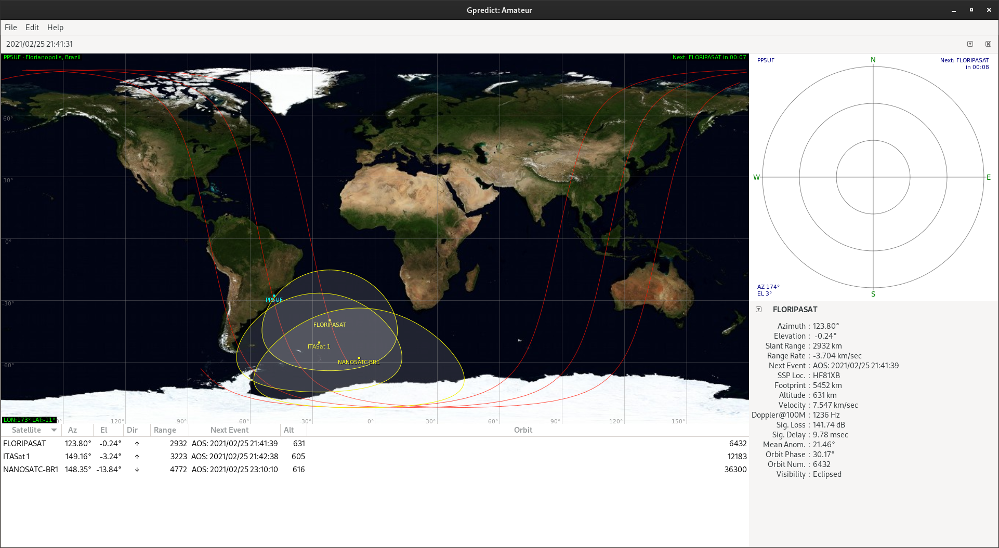

********
Software
********

Software Architecture
=====================
.. _fig:software-diagram:

   Ground station software diagram.

Station Server
--------------

- **Rotor Manager**: `https://github.com/spacelab-ufsc/grs-rotor-manager <https://github.com/spacelab-ufsc/grs-rotor-manager>`__
- **FFT**: `https://github.com/spacelab-ufsc/grs-fft <https://github.com/spacelab-ufsc/grs-fft>`__
- **IQ Receiver**: `https://github.com/spacelab-ufsc/grs-iq-rx <https://github.com/spacelab-ufsc/grs-iq-rx>`__
- **Demodulator**: `https://github.com/spacelab-ufsc/grs-demodulator <https://github.com/spacelab-ufsc/grs-demodulator>`__
- **Sync. Word Detector**: `https://github.com/spacelab-ufsc/grs-syncword-detector <https://github.com/spacelab-ufsc/grs-syncword-detector>`__
- **Frequency Synth.**: `https://github.com/spacelab-ufsc/grs-frequency-synthesizer <https://github.com/spacelab-ufsc/grs-frequency-synthesizer>`__
- **Modulator**: `https://github.com/spacelab-ufsc/grs-modulator <https://github.com/spacelab-ufsc/grs-modulator>`__
- **RF Front-End Controller**: TODO.

Control Server
--------------

- **Dashboard Backend**: Grafana.
- **Database**: `Database`_
- **Data Link Layer Decoders**: TODO.
- **Network Layer Decoders**: TODO.
- **Satellite Data Decoders**: TODO.
- **Station Manager**: TODO.
- **Data Link Layer Encoder**: TODO.
- **Network Layer Encoder**: TODO.
- **Satellite TC Scheduler**: TODO.

Control Desktop
---------------

- **Dashboard**: TODO.
- **Satellite Tracker**: GPredict.
- **GRS Manager**: TODO.
- **Spectrum Monitor**: `Spectrum Monitor`_
- **Satellite TC Generator**: `https://github.com/spacelab-ufsc/grs-tc-generator <https://github.com/spacelab-ufsc/grs-tc-generator>`__

.. ##########################################################
.. ##########################################################
.. ##########################################################

Applications
============

- `Database`_
- `Spectrum Monitor`_
- `Satellite TC Generator`_
- `GRS FFT`_
- `Syncword Detector`_
- `Frequency Synthesizer`_
- `IQ Receiver`_
- `Rotor Manager`_
- `Demodulator`_

.. ##########################################################
.. ##########################################################
.. ##########################################################

Database
--------

The database component is responsible for storing and managing the vast amount of data generated by the ground station. This includes satellite telemetry, mission control data, and station logs. The system utilizes a combination of PostgreSQL and TimescaleDB to efficiently handle time-series data, which is critical for orbital analysis and historical tracking.

Key Features
~~~~~~~~~~~~

- **Time-Series Optimization**: Leverages TimescaleDB to handle high-frequency telemetry data with high ingestion rates.
- **Data Segregation**: Uses distinct schemas for different types of data:
    - ``mission_control``: Stores dimension data such as satellite metadata and packet definitions.
    - ``telemetry_stream``: Stores fact data (Hypertables) for massive volumes of signal readings.
- **Performance**: Optimized for write-heavy workloads by minimizing foreign key constraints on high-volume tables and using batch insertion strategies.

Architecture
~~~~~~~~~~~~

The database architecture is designed to support the specific needs of satellite operations:

1. **Dimension Tables**: Located in the ``mission_control`` schema, these tables hold slowly changing data like satellite identifiers and packet configurations.
2. **Fact Tables (Hypertables)**: Located in the ``telemetry_stream`` schema, these tables are partitioned by time to allow for efficient querying and management of historical data.

Usage
~~~~~

Data population strategies include:

- **Batch Inserts**: For real-time applications, inserting data in large batches is recommended to maximize throughput.
- **Bulk Import**: The ``COPY`` command is used for importing large historical datasets from CSV files.

For more details on the database schema and setup scripts, refer to the project repository.

.. ##########################################################
.. ##########################################################
.. ##########################################################

Spectrum Monitor
----------------

The Spectrum Monitor is a real-time visualization tool designed for the FloripaSat-2A ground station. It processes raw IQ samples via UDP, performs Fast Fourier Transform (FFT), and renders an interactive Waterfall display in the browser. This component is essential for monitoring signal quality and detecting interference during satellite passes.

Key Features
~~~~~~~~~~~~

- **Real-time FFT Plot**: Displays the instantaneous spectral density as a line graph.
- **Waterfall Display**: Provides a historical view of frequency over time using a thermal color palette.
- **Dynamic Gain Control**: Allows users to adjust the visual sensitivity of the signal display.
- **Signal Detection**: Includes a configurable threshold line with visual alerts for signal detection.
- **Microservices Architecture**: Built to be easily integrated via Docker and WebSockets.

Architecture
~~~~~~~~~~~~

The Spectrum Monitor is structured as follows:

- **Backend**: Python-based application using Flask and Socket.IO for real-time communication.
- **DSP Processing**: Utilizes NumPy for Digital Signal Processing (DSP), including Hamming windowing and FFT conversion.
- **Frontend**: HTML5 Canvas for high-performance rendering of the waterfall display.
- **Concurrency**: Managed by Eventlet to handle network threads and web server requests efficiently.

Usage
~~~~~

To use the Spectrum Monitor:

1. **Start the Simulator**: Run the mock IQ sender to simulate radio signals.
2. **Launch the Server**: Start the backend processing server.
3. **Access the Interface**: Open a web browser to view the real-time spectrum data.

For integration with real hardware, the UDP stream can be configured to receive data from the Station Server.

.. ##########################################################
.. ##########################################################
.. ##########################################################

Satellite TC Generator
----------------------

The Satellite TC Generator is a web-based application designed for the generation and management of telecommands for satellites. It provides a user-friendly interface for creating, scheduling, and sending commands to the satellite.

Key Features
~~~~~~~~~~~~

- **Web Interface**: Built with Flask, offering a responsive and intuitive UI for operators.
- **Command Management**: Allows for the creation and storage of telecommand definitions.
- **Database Integration**: Uses PostgreSQL for persistent storage of command history and configurations.
- **Microservices Architecture**: Designed to be deployed as a containerized service within the larger ground station ecosystem.

Architecture
~~~~~~~~~~~~

The TC Generator follows a modular architecture:

- **Core Application**: Flask-based web server handling HTTP requests and routing.
- **Services Layer**: Encapsulates business logic for telecommand processing.
- **Repositories**: Manages data access using database adapters.
- **Models**: Defines the data structures for satellites and telecommands.

Usage
~~~~~

To set up and run the TC Generator:

1. **Environment Setup**: Create a virtual environment and install dependencies.
2. **Database Initialization**: Run database migrations to set up the schema.
3. **Run Application**: Start the Flask server to access the web interface.

The application is configured via environment variables and can be easily deployed using Docker.

.. ##########################################################
.. ##########################################################
.. ##########################################################

GRS FFT
-------

GRS FFT is a real-time Fast Fourier Transform (FFT) calculator for SpaceLab's Ground Station. It is part of the ground station's signal processing pipeline, sitting between the IQ sample receiver and the spectrum visualization components.

The program subscribes to a ZMQ publisher socket where it receives a continuous stream of raw IQ samples. Once a full frame is accumulated, it applies a Hann window to reduce spectral leakage and computes a complex FFT, which can be used by downstream components.

Key Features
~~~~~~~~~~~~

- **Real-time IQ Processing**: Continuously receives IQ sample streams over ZMQ.
- **Hann Windowing**: Applies a Hann window to both I and Q components before transformation to minimize spectral leakage.
- **ZMQ Integration**: Built around the ZeroMQ messaging library for seamless integration with other ground station microservices.
- **Lightweight and Efficient**: Written in C with minimal dependencies, optimized for low-latency signal processing.

Architecture
~~~~~~~~~~~~

GRS FFT is structured around a simple and efficient signal processing pipeline:

- **Input**: A ZMQ SUB socket connected to the upstream IQ receiver.
- **Buffering**: IQ samples are accumulated into fixed-size frames before processing.
- **DSP Processing**: A Hann window is applied prior to FFT computation.
- **FFT Computation**: An in-place forward complex DFT is performed on each windowed sample frame.
- **Output**: The resulting frequency-domain data is made available to downstream components such as the Spectrum Monitor.

Usage
~~~~~

To use GRS FFT:

1. **Install dependencies**: Install the required libraries.
2. **Build the project**: Compile the project using the provided build system.
3. **Start the IQ receiver**: Ensure the upstream IQ sample publisher is running and reachable.
4. **Run GRS FFT**: Execute the compiled binary to begin receiving samples and computing FFT frames in real time.

.. ##########################################################
.. ##########################################################
.. ##########################################################

Syncword Detector
-----------------

GRS Syncword Detector is a C library component of SpaceLab's Ground Station signal processing pipeline. It sits between the demodulator and the decoder, and is responsible for identifying the start of a transmission by detecting a known synchronization word (syncword) within an incoming bit stream.

The component supports both MSB-first and LSB-first bit endianness, and performs tolerance-based matching by counting the number of bits that match the expected syncword pattern, allowing it to handle minor bit errors in the received stream.

Key Features
~~~~~~~~~~~~

- **Syncword Detection**: Identifies the start of a transmission frame by searching for a known bit pattern in the incoming stream.
- **Endianness Support**: Handles both MSB-first and LSB-first bit ordering to accommodate different modulation and framing conventions.
- **Tolerance-Based Matching**: Counts matching bits rather than requiring a strict equality, providing robustness against minor bit errors.
- **Lightweight**: Written in C with no external dependencies, suitable for integration into larger ground station pipelines.

Architecture
~~~~~~~~~~~~

The syncword detector is structured as a reusable library component:

- **Input**: A raw bit stream produced by the upstream demodulator.
- **Syncword Definition**: A configurable byte sequence and endianness that defines the expected synchronization pattern.
- **Bit Expansion**: Each syncword byte is expanded into its individual bits, respecting the configured endianness, for bit-level comparison.
- **Matching**: A sliding window scans the incoming bit stream and counts how many bits match the syncword pattern at each position.
- **Output**: The match score at each position, which the caller uses to determine the start of a transmission frame and pass it to the decoder.

Usage
~~~~~

To use GRS Syncword Detector:

1. **Build the project**: Compile the component using the provided build system.
2. **Define the syncword**: Create a syncword instance by providing the expected byte sequence and bit endianness.
3. **Feed the bit stream**: Pass incoming bits from the demodulator through the matching function.
4. **Detect frame start**: Use the match score to determine when a valid syncword has been found and forward the frame to the decoder.
5. **Clean up**: Destroy the syncword instance to free allocated resources.

.. ##########################################################
.. ##########################################################
.. ##########################################################

Frequency Synthesizer
---------------------

The GRS Frequency Synthesizer is an internal component of SpaceLab's Ground Station software pipeline. It sits between the Station Manager and the IQ Receiver, responsible for computing the effective tuning frequency at any given moment by combining the base center frequency with a Doppler correction offset, and forwarding the result to the IQ Receiver as a tune command.

The IQ Receiver is autonomous and does not depend on the Frequency Synthesizer to operate — it simply reacts to tune commands whenever they arrive. The Frequency Synthesizer is an optional layer that handles Doppler correction math on top, as well as any changes in the center frequency.

Key Features
~~~~~~~~~~~~

- **Doppler Correction**: Combines a base center frequency with a pre-computed Doppler offset to produce the effective tuning frequency at any given moment.
- **ZMQ Integration**: Subscribes to commands from the Station Manager and publishes tune commands to the IQ Receiver over ZMQ.
- **Graceful Startup**: Withholds tune commands until a valid center frequency has been received, preventing the IQ Receiver from being tuned to an undefined frequency.
- **Stateful Offset Tracking**: Maintains the current Doppler offset independently from the center frequency, updating either as new commands arrive.
- **Lightweight**: Implemented as a single Python class with minimal dependencies, designed to be embedded in the Station Manager process.

Architecture
~~~~~~~~~~~~

The Frequency Synthesizer is structured as a managed pipeline component:

- **Input**: A ZMQ SUB socket connected to the Station Manager, subscribed to center frequency and Doppler offset update commands.
- **State**: Maintains the current center frequency and Doppler offset internally, updating each independently as commands arrive.
- **Computation**: The effective tuning frequency is calculated as the sum of the center frequency and the current Doppler offset.
- **Output**: A ZMQ PUB socket that publishes tune commands to the IQ Receiver whenever the effective frequency changes.

.. note::
   The Frequency Synthesizer does not compute Doppler shifts itself. It expects the Station Manager or a dedicated propagator module to supply pre-computed Doppler offsets.

Usage
~~~~~

To use the GRS Frequency Synthesizer:

1. **Install dependencies**: Install the required Python packages.
2. **Instantiate the class**: Create a ``FrequencySynthesizer`` instance with the appropriate ZMQ addresses for the IQ Receiver and Station Manager.
3. **Start the synthesizer**: Call ``run()`` to begin listening for commands and publishing tune updates.
4. **Send a center frequency**: The Station Manager must send an initial ``freq`` command before any tune commands are forwarded to the IQ Receiver.
5. **Send Doppler offsets**: The Station Manager (or propagator module) sends periodic ``doppler`` commands to keep the tuning frequency compensated in real time.
6. **Stop gracefully**: Call ``stop()`` to shut down the synthesizer and release ZMQ resources.

.. ##########################################################
.. ##########################################################
.. ##########################################################

IQ Receiver
-----------

The GRS IQ Receiver is the SDR front-end of SpaceLab's Ground Station signal processing pipeline. It reads raw IQ samples from a Software Defined Radio (SDR) device and publishes them over ZMQ to downstream components such as the FFT Calculator and the demodulator.

The component is available in two implementations targeting different SDR hardware. Both normalize raw samples to floating-point IQ format and publish them continuously for consumption by downstream pipeline components.

Key Features
~~~~~~~~~~~~

- **Dual Implementation**: Available as a C application targeting RTL-SDR devices, and as a Python application targeting Pluto and USRP devices.
- **Continuous IQ Streaming**: Publishes a continuous stream of normalized floating-point IQ samples over ZMQ for consumption by downstream components.
- **Dynamic Retuning**: The Python implementation listens for tune commands from the Frequency Synthesizer, allowing the center frequency to be updated at runtime without restarting.
- **Flexible Acquisition**: The C implementation supports both synchronous and asynchronous acquisition modes, with configurable gain, sample rate, bandwidth, PPM correction, and block size.
- **ZMQ Integration**: Built around the ZeroMQ messaging library for integration with other ground station microservices.

Architecture
~~~~~~~~~~~~

The IQ Receiver sits between the Frequency Synthesizer and the downstream signal processing components:

- **SDR Input**: Acquires IQ samples directly from the connected SDR hardware.
- **Normalization**: Raw device samples are converted to normalized floating-point complex (IQ) format before publishing.
- **Buffering**: Samples are accumulated into fixed-size buffers before being dispatched to avoid flooding downstream subscribers.
- **ZMQ Output**: A ZMQ PUB socket continuously publishes buffered IQ sample frames to the FFT Calculator and demodulator.
- **Retune Input**: A ZMQ SUB socket listens for tune commands from the Frequency Synthesizer and updates the SDR center frequency at runtime.

Usage
~~~~~

To use the GRS IQ Receiver:

1. **Install dependencies**: Install the required libraries for the chosen implementation.
2. **Connect the SDR hardware**: Ensure the SDR device is connected and recognized by the system.
3. **Start the IQ Receiver**: Launch the application with the desired center frequency, sample rate, and gain.
4. **Start downstream components**: The FFT Calculator and demodulator can now connect and begin consuming the published IQ stream.
5. **Retune at runtime**: Start the Frequency Synthesizer to send dynamic tune commands as the satellite pass progresses.

.. ##########################################################
.. ##########################################################
.. ##########################################################

Rotor Manager
-------------

The GRS Rotor Manager is an internal component of SpaceLab's Ground Station software pipeline. It is responsible for sending positioning commands to an AlfaSpid RAS-2 azimuth/elevation rotator via the Rot2Prog binary serial protocol, allowing the ground station antenna to physically track a satellite pass.

The component is driven by the Station Manager, which supplies azimuth and elevation angles computed by a propagator module. The Rotor Manager translates these angles into binary protocol packets and dispatches them to the rotator over ZMQ, while also handling status queries and stop commands.

Key Features
~~~~~~~~~~~~

- **Antenna Tracking**: Commands the AlfaSpid RAS-2 rotator to continuously point the antenna at the satellite by accepting azimuth and elevation targets from the Station Manager.
- **Rot2Prog Protocol**: Encodes all commands as 11-byte binary packets following the Rot2Prog protocol, compatible with the AlfaSpid controller.
- **Status Polling**: Supports querying the rotator's current position, returning the live azimuth and elevation reported by the hardware.
- **ZMQ Integration**: Sends commands over a ZMQ PUSH socket and receives status responses over a ZMQ SUB socket, integrating seamlessly with the rest of the ground station pipeline.
- **Hardware Simulator**: Ships with a standalone rotator simulator for testing the pipeline without physical hardware.

Architecture
~~~~~~~~~~~~

The Rotor Manager acts as the bridge between the Station Manager and the physical rotator hardware:

- **Input**: Method calls from the Station Manager — ``set_position()``, ``stop()``, and ``request_status()`` — supplying azimuth and elevation angles.
- **Encoding**: Target angles are encoded into the Rot2Prog 11-byte binary packet format.
- **ZMQ Output**: Packets are dispatched over a ZMQ PUSH socket to the rotator or its simulator.
- **Status Input**: A ZMQ SUB socket receives status responses from the rotator, returning the current azimuth and elevation as packed 32-bit floats.

Usage
~~~~~

To use the GRS Rotor Manager:

1. **Install dependencies**: Install the required Python packages.
2. **Set the rotator to CPU mode**: Ensure the AlfaSpid RAS-2 front panel is set to CPU (Auto) mode so it accepts software commands.
3. **Instantiate the class**: Create a ``RotorManager`` instance, passing the ZMQ address of the rotator or simulator.
4. **Issue positioning commands**: Call ``set_position()`` with the azimuth and elevation to point the antenna.
5. **Poll status as needed**: Call ``request_status()`` to retrieve the rotator's current position.
6. **Stop and clean up**: Call ``stop()`` to halt the rotator and ``close()`` to release ZMQ resources after the satellite pass.

.. note::
   For testing without hardware, run the included ``rotor_simulator.py`` in place of the physical rotator. It accepts the same ZMQ commands and responds with simulated position data.

.. ##########################################################
.. ##########################################################
.. ##########################################################

Demodulator
-----------

The GRS Demodulator is a GMSK demodulator for SpaceLab's Ground Station signal processing pipeline. It sits between the IQ Receiver and the syncword detector and decoder, receiving a continuous stream of complex IQ samples over ZMQ and publishing a recovered bitstream for downstream processing.

Key Features
~~~~~~~~~~~~

- **GMSK Demodulation**: Implements a full software GMSK demodulation pipeline operating on complex IQ samples.
- **GMSK Modulation**: Includes a GMSK modulator, enabling closed-loop simulation and unit testing of the full modulation/demodulation chain without hardware.
- **Gaussian Matched Filtering**: Applies a Gaussian filter matched to the signal's BT product to reduce inter-symbol interference prior to symbol decisions.
- **Symbol Timing Recovery**: Synchronizes sampling instants to symbol boundaries to reliably recover the bitstream under realistic channel conditions.
- **ZMQ Integration**: Subscribes to IQ sample frames from the IQ Receiver and publishes the recovered bitstream to downstream components over ZMQ.

Architecture
~~~~~~~~~~~~

The GRS Demodulator is structured as a streaming DSP pipeline:

- **Input**: A ZMQ SUB socket receiving buffered complex IQ sample frames from the IQ Receiver.
- **Frequency Discriminator**: Extracts instantaneous frequency deviations by computing the phase derivative of the incoming IQ samples.
- **Gaussian Matched Filter**: Filters the frequency deviation signal with a Gaussian filter matched to the BT product, reducing inter-symbol interference.
- **Normalization**: Centers and scales the filtered signal to ensure reliable downstream symbol decisions.
- **Timing Recovery**: Recovers symbol timing from the filtered signal, aligning the sampling instants to the transmitted symbol boundaries.
- **Hard Decision**: Thresholds the soft symbols into a binary bitstream.
- **Output**: A ZMQ PUB socket publishing the recovered bitstream to the syncword detector and decoder.

Usage
~~~~~

To use the GRS Demodulator:

1. **Install dependencies**: Install the required Python packages.
2. **Start the IQ Receiver**: Ensure the upstream IQ Receiver is running and publishing IQ sample frames.
3. **Run the demodulator**: Launch the application to begin consuming IQ frames and publishing the recovered bitstream.
4. **Start downstream components**: The syncword detector and decoder can now connect and begin processing the demodulated bitstream.

.. ##########################################################
.. ##########################################################
.. ##########################################################

Satellite Tracking
==================

To track the satellite and for orbit prediction, the GPredict software :cite:`gpredict` will be used. Gpredict is a real-time satellite tracking and orbit prediction application. It can track a large number of satellites and display their position and other data in lists, tables, maps, and polar plots (radar view). Gpredict can also predict the time of future passes for a satellite, and provide you with detailed information about each pass. Gpredict is free software licensed under the GNU General Public License. A picture of the main window of GPredict can be seen in :numref:`fig:gpredict`.

.. _fig:gpredict:

   Main window of GPredict.
