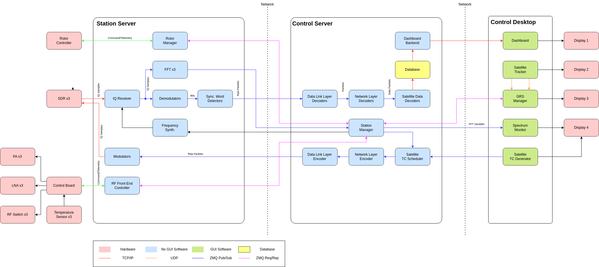
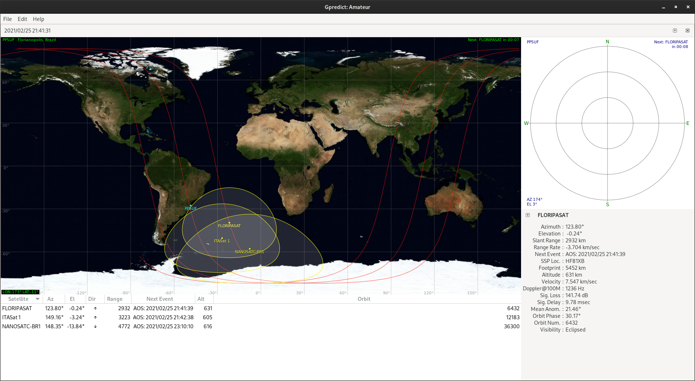

.. software.rst

   Copyright The Ground Station Contributors.

   Ground Station Documentation

   This work is licensed under the Creative Commons Attribution-ShareAlike 4.0
   International License. To view a copy of this license,
   visit http://creativecommons.org/licenses/by-sa/4.0/.

********
Software
********

Software Architecture
=====================

The software architecture presented in the diagram of :numref:`fig:software-diagram` was designed for a modular and distributed ground station intended for satellite communication, tracking, and control operations. The architecture is organized into three main segments: *Station Server, Control Server, and Control Desktop*,enabling a clear separation between RF signal processing, communication protocol handling, and operator interfaces. This organization improves scalability, simplifies maintenance, and allows computational workloads to be distributed across multiple machines within the ground station infrastructure.

.. _fig:software-diagram:

   Ground station software diagram.

The Station Server is responsible for RF processing and for interfacing directly with the hardware components of the ground station. This module communicates with SDR receivers, power amplifiers, LNAs, RF switches, temperature sensors, and the antenna rotor controller. The software running on this server performs IQ sample acquisition from the SDRs, automatic frequency tuning through the Frequency Synthesizer, spectral analysis using FFT processing, and signal demodulation. After bit recovery, the Sync Word Detectors identify valid communication frames and forward raw packets to the upper layers of the system. In the transmission path, the server receives telecommand packets, performs signal modulation, and sends IQ samples to the SDR transmitters. The server also includes dedicated modules for antenna rotor management and RF front-end control, enabling full automation of the physical station infrastructure.

The Control Server acts as the logical core of the system and is responsible for coordinating communications between stations, processing satellite communication protocols, and managing overall ground station operations. Packets received from the Station Server are first processed by the Data Link Layer Decoders and subsequently by the Network Layer Decoders. After reconstructing the payload data, the Satellite Data Decoders interpret telemetry, housekeeping information, and payload data from the satellites. The decoded information is then stored in a database for visualization, monitoring, and historical analysis. This server also executes centralized station management through the Station Manager module, which coordinates distributed services, synchronizes operational states, and handles control messaging among the system components.

In addition to telemetry processing, the Control Server is also responsible for telecommand generation and scheduling. The Satellite Telecommand (TC) Scheduler organizes command transmissions according to communication windows, operational priorities, and mission constraints. After scheduling, the commands are encapsulated by the Network Layer Encoder and Data Link Layer Encoder modules before being forwarded to the Station Server for modulation and RF transmission toward the satellite.

Communication between the different software modules is implemented using multiple specialized protocols. Low-level hardware interfaces rely on TCP/IP and UDP communication, while internal distributed messaging between software components is performed using the ZeroMQ middleware. The Pub/Sub communication model is used for continuous streaming of telemetry, spectrum data, and operational status information, whereas the Req/Rep model is employed for synchronous command and control operations. This approach decouples the software modules and allows new services and functionalities to be integrated into the system without requiring major architectural modifications.

The Control Desktop represents the human-machine interface layer of the architecture. This environment contains the graphical applications used by the operators during satellite operations, including the Dashboard, Satellite Tracker, GRS Manager, Spectrum Monitor, and Satellite TC Generator. These applications can be distributed across multiple displays and workstations, enabling flexible and distributed operation of the ground station during simultaneous satellite communication sessions.

The proposed architecture follows a modular microservice-oriented approach based on distributed processing principles. The separation between RF processing, protocol handling, and graphical interfaces minimizes coupling between subsystems and improves maintainability, scalability, and fault isolation. Furthermore, the use of SDR technology and standardized communication interfaces makes the system adaptable to different satellite missions, communication protocols, and frequency bands, allowing its use in CubeSat constellations, scientific satellites, and Earth observation missions.

Station Server
--------------

- **Rotor Manager**: `https://github.com/spacelab-ufsc/grs-rotor-manager <https://github.com/spacelab-ufsc/grs-rotor-manager>`__
- **FFT**: `https://github.com/spacelab-ufsc/grs-fft <https://github.com/spacelab-ufsc/grs-fft>`__
- **IQ Receiver**: `https://github.com/spacelab-ufsc/grs-iq-rx <https://github.com/spacelab-ufsc/grs-iq-rx>`__
- **Demodulator**: `https://github.com/spacelab-ufsc/grs-demodulator <https://github.com/spacelab-ufsc/grs-demodulator>`__
- **Sync. Word Detector**: `https://github.com/spacelab-ufsc/grs-syncword-detector <https://github.com/spacelab-ufsc/grs-syncword-detector>`__
- **Frequency Synth.**: `https://github.com/spacelab-ufsc/grs-frequency-synthesizer <https://github.com/spacelab-ufsc/grs-frequency-synthesizer>`__
- **Modulator**: `https://github.com/spacelab-ufsc/grs-modulator <https://github.com/spacelab-ufsc/grs-modulator>`__
- **RF Front-End Controller**: TODO.

Control Server
--------------

- **Dashboard Backend**: `Grafana Repository <https://github.com/spacelab-ufsc/grs-server-nadir/tree/ops-structure-nadir-server/services/dashboard-backend>`__
- **Database**: `Database Repository <https://github.com/spacelab-ufsc/grs-server-nadir/tree/ops-structure-nadir-server/services/database>`__
- **Data Link Layer Decoders**: TODO.
- **Network Layer Decoders**: TODO.
- **Satellite Data Decoders**: TODO.
- **Station Manager**: TODO.
- **Data Link Layer Encoder**: TODO.
- **Network Layer Encoder**: TODO.
- **Satellite TC Scheduler**: TODO.

Control Desktop
---------------

- **Dashboard**: `SpaceLab Grafana Web <http://150.162.11.194:3000>`__
- **Satellite Tracker**: GPredict.
- **GRS Manager**: TODO.
- **Spectrum Monitor**: `Spectrum Monitor`_
- **Satellite TC Generator**: `TC Generator Web <http://150.162.11.194:5000>`__

.. ##########################################################
.. ##########################################################
.. ##########################################################

Applications
============
- `Dashboards`_
- `Database`_
- `Spectrum Monitor`_
- `Satellite TC Generator`_
- `GRS FFT`_
- `Syncword Detector`_
- `Frequency Synthesizer`_
- `IQ Receiver`_
- `Rotor Manager`_
- `Demodulator`_

.. ##########################################################
.. ##########################################################
.. ##########################################################

Dashboards
----------

The visualization component acts as the primary control panel for ground station operators and researchers. Using Grafana, an industry-standard open-source analytics platform, the system transforms raw numerical readings stored in the database into intuitive, real-time visual dashboards. This enables mission operators to monitor satellite health, track power consumption, and observe orbital positions at a glance during active passes.

Key Features
~~~~~~~~~~~~

- **Real-Time Mission Telemetry**: Provides instant visual feedback on critical satellite subsystems, such as battery levels, temperatures, and radio signal strength (RSSI).
- **Orbital Tracking via Geomap**: Features an integrated global map display that plots the satellite's exact latitude, longitude, and altitude in real time as telemetries are received.
- **Automated Dashboard Provisioning (Infrastructure as Code)**: Dashboard layouts are fully defined using JSON configuration files within the code repository. This eliminates manual setup and ensures that cloning the project automatically deploys identical monitoring panels on any official server.
- **Intuitive Status Indicators**: Utilizes color-coded visual thresholds (e.g., green for nominal operations, yellow/red for warnings or critical states) and custom value mappings to translate binary computer codes into readable system modes (such as *NOMINAL*, *SAFE MODE*, or *PAYLOAD EXEC*).

Architecture
~~~~~~~~~~~~

The dashboard system is seamlessly integrated into the ground station software stack:

1. **Isolated Data Access**: The Grafana instance connects to PostgreSQL via a dedicated, read-only database role. This security boundary prevents the dashboard from accidentally modifying or corrupting core telemetry records.
2. **Subsystem-Specific Views**: Telemetry displays are segregated into focused operational views:
    - **General Telemetry Dashboard**: Monitors overall satellite health, computer reset counters, onboard timestamps, and real-time geographical coordinates.
    - **EPS Telemetry Dashboard**: Dedicated to the Electrical Power Subsystem, displaying battery charging cycles, main bus voltages, solar panel currents, and thermal sensor metrics.
3. **Multi-Satellite Support**: Includes dynamic filtering controls at the top of every dashboard, allowing operators to switch between different space assets (such as GOLDS-UFSC or the Catarina constellation) without leaving the interface.

Usage
~~~~~

The dashboard environment is designed for zero-maintenance operation during ground station passes:

- **Automatic Refresh**: Dashboards update automatically at short intervals (e.g., every 5 seconds) to reflect live incoming space data.
- **Historical Analysis**: Operators can adjust the global time selector to review historical trends over days or months, aiding in long-term degradation analysis of solar panels and batteries.

For additional dashboard templates and configuration files, refer to the `SpaceLab GitHub Repository <https://github.com/spacelab-ufsc/grs-server-nadir/tree/ops-structure-nadir-server/services/dashboard-backend>`_.

.. ##########################################################
.. ##########################################################
.. ##########################################################

Database
--------

The database component is the central memory of the Ground Station, responsible for safely storing and organizing all data received from space. This includes real-time health metrics from satellites, scientific payload measurements, and station activity logs. To support both current missions (such as GOLDS-UFSC and the Catarina constellation) and future satellite launches without requiring structural changes, the system utilizes PostgreSQL extended with TimescaleDB. This combination provides a robust foundation for high-performance time-series data analysis.

Key Features
~~~~~~~~~~~~

- **Scalable & Mission-Agnostic Design**: Instead of creating separate database tables for each satellite, the system uses a generic data model. Telemetries from any satellite are stored in unified, standardized tables using unique identification tags (callsigns), allowing seamless support for new missions.
- **Time-Series Optimization**: Leverages TimescaleDB (an extension designed for time-stamped data) to process continuous streams of satellite readings with high speed and low storage overhead.
- **Role-Based Security**: Employs strict permission controls where services (such as data ingestors, analytical dashboards, and administrative utilities) operate under isolated database roles with minimal required privileges, protecting the core data from unauthorized access.

Architecture
~~~~~~~~~~~~

The database architecture is structured around specialized schemas to balance operational security and analytical performance:

1. **Processed Telemetry Schema (``telemetry_processed``)**: Holds standardized, high-performance time-series tables (such as general satellite health and electrical power subsystem telemetry). These tables are optimized for instant querying by operational dashboards and ground operators.
2. **Telecommand Schema (``telecommand_db``)**: Dedicated to logging transmitted control commands and monitoring their queue status, ensuring full traceability of ground-to-space interactions.
3. **Intelligence Schema (``intelligence_db``)**: Serves as the central repository for processed mission metrics, feeding real-time status indicators and alerting systems.

Usage
~~~~~

To maintain system stability during continuous satellite passes, data ingestion and query strategies include:

- **Automated Reconnection & Fallback**: Ingestion services feature built-in resilience, automatically handling network fluctuations or database restarts without losing telemetry packets.
- **Batch Insertion**: High-frequency telemetry readings are written using optimized insertion routines to maximize throughput and reduce server load.
- **Time-Filtered Queries**: Analytical requests leverage automated time-window filtering to allow ground operators to inspect both live passes and multi-year historical trends efficiently.

For detailed database schemas, setup scripts, and technical deployment guides, refer to the `SpaceLab GitHub Repository <https://github.com/spacelab-ufsc/grs-server-nadir/tree/ops-structure-nadir-server/services/database>`_.

.. ##########################################################
.. ##########################################################
.. ##########################################################

Spectrum Monitor
----------------

The Spectrum Monitor is a real-time visualization tool designed for the FloripaSat-2A ground station. It processes raw IQ samples via UDP, performs Fast Fourier Transform (FFT), and renders an interactive Waterfall display in the browser. This component is essential for monitoring signal quality and detecting interference during satellite passes.

Key Features
~~~~~~~~~~~~

- **Real-time FFT Plot**: Displays the instantaneous spectral density as a line graph.
- **Waterfall Display**: Provides a historical view of frequency over time using a thermal color palette.
- **Dynamic Gain Control**: Allows users to adjust the visual sensitivity of the signal display.
- **Signal Detection**: Includes a configurable threshold line with visual alerts for signal detection.
- **Microservices Architecture**: Built to be easily integrated via Docker and WebSockets.

Architecture
~~~~~~~~~~~~

The Spectrum Monitor is structured as follows:

- **Backend**: Python-based application using Flask and Socket.IO for real-time communication.
- **DSP Processing**: Utilizes NumPy for Digital Signal Processing (DSP), including Hamming windowing and FFT conversion.
- **Frontend**: HTML5 Canvas for high-performance rendering of the waterfall display.
- **Concurrency**: Managed by Eventlet to handle network threads and web server requests efficiently.

Usage
~~~~~

To use the Spectrum Monitor:

1. **Start the Simulator**: Run the mock IQ sender to simulate radio signals.
2. **Launch the Server**: Start the backend processing server.
3. **Access the Interface**: Open a web browser to view the real-time spectrum data.

For integration with real hardware, the UDP stream can be configured to receive data from the Station Server.

.. ##########################################################
.. ##########################################################
.. ##########################################################

Satellite TC Generator
----------------------

The Satellite TC Generator is a web-based application designed for the generation and management of telecommands for satellites. It provides a user-friendly interface for creating, scheduling, and sending commands to the satellite.

Key Features
~~~~~~~~~~~~

- **Web Interface**: Built with Flask, offering a responsive and intuitive UI for operators.
- **Command Management**: Allows for the creation and storage of telecommand definitions.
- **Database Integration**: Uses PostgreSQL for persistent storage of command history and configurations.
- **Microservices Architecture**: Designed to be deployed as a containerized service within the larger ground station ecosystem.

Architecture
~~~~~~~~~~~~

The TC Generator follows a modular architecture:

- **Core Application**: Flask-based web server handling HTTP requests and routing.
- **Services Layer**: Encapsulates business logic for telecommand processing.
- **Repositories**: Manages data access using database adapters.
- **Models**: Defines the data structures for satellites and telecommands.

Usage
~~~~~

To set up and run the TC Generator:

1. **Environment Setup**: Create a virtual environment and install dependencies.
2. **Database Initialization**: Run database migrations to set up the schema.
3. **Run Application**: Start the Flask server to access the web interface.

The application is configured via environment variables and can be easily deployed using Docker.

For detailed database schemas, setup scripts, and technical deployment guides, refer to the `See Repository on github <https://github.com/spacelab-ufsc/grs-server-nadir/tree/ops-structure-nadir-server/services/tc_generator_web>`__

.. ##########################################################
.. ##########################################################
.. ##########################################################

GRS FFT
-------

GRS FFT is a real-time Fast Fourier Transform (FFT) calculator for SpaceLab's Ground Station. It is part of the ground station's signal processing pipeline, sitting between the IQ sample receiver and the spectrum visualization components.

The program subscribes to a ZMQ publisher socket where it receives a continuous stream of raw IQ samples. Once a full frame is accumulated, it applies a Hann window to reduce spectral leakage and computes a complex FFT, which can be used by downstream components.

Key Features
~~~~~~~~~~~~

- **Real-time IQ Processing**: Continuously receives IQ sample streams over ZMQ.
- **Hann Windowing**: Applies a Hann window to both I and Q components before transformation to minimize spectral leakage.
- **ZMQ Integration**: Built around the ZeroMQ messaging library for seamless integration with other ground station microservices.
- **Lightweight and Efficient**: Written in C with minimal dependencies, optimized for low-latency signal processing.

Architecture
~~~~~~~~~~~~

GRS FFT is structured around a simple and efficient signal processing pipeline:

- **Input**: A ZMQ SUB socket connected to the upstream IQ receiver.
- **Buffering**: IQ samples are accumulated into fixed-size frames before processing.
- **DSP Processing**: A Hann window is applied prior to FFT computation.
- **FFT Computation**: An in-place forward complex DFT is performed on each windowed sample frame.
- **Output**: The resulting frequency-domain data is made available to downstream components such as the Spectrum Monitor.

Usage
~~~~~

To use GRS FFT:

1. **Install dependencies**: Install the required libraries.
2. **Build the project**: Compile the project using the provided build system.
3. **Start the IQ receiver**: Ensure the upstream IQ sample publisher is running and reachable.
4. **Run GRS FFT**: Execute the compiled binary to begin receiving samples and computing FFT frames in real time.

.. ##########################################################
.. ##########################################################
.. ##########################################################

Syncword Detector
-----------------

GRS Syncword Detector is a C library component of SpaceLab's Ground Station signal processing pipeline. It sits between the demodulator and the decoder, and is responsible for identifying the start of a transmission by detecting a known synchronization word (syncword) within an incoming bit stream.

The component supports both MSB-first and LSB-first bit endianness, and performs tolerance-based matching by counting the number of bits that match the expected syncword pattern, allowing it to handle minor bit errors in the received stream.

Key Features
~~~~~~~~~~~~

- **Syncword Detection**: Identifies the start of a transmission frame by searching for a known bit pattern in the incoming stream.
- **Endianness Support**: Handles both MSB-first and LSB-first bit ordering to accommodate different modulation and framing conventions.
- **Tolerance-Based Matching**: Counts matching bits rather than requiring a strict equality, providing robustness against minor bit errors.
- **Lightweight**: Written in C with no external dependencies, suitable for integration into larger ground station pipelines.

Architecture
~~~~~~~~~~~~

The syncword detector is structured as a reusable library component:

- **Input**: A raw bit stream produced by the upstream demodulator.
- **Syncword Definition**: A configurable byte sequence and endianness that defines the expected synchronization pattern.
- **Bit Expansion**: Each syncword byte is expanded into its individual bits, respecting the configured endianness, for bit-level comparison.
- **Matching**: A sliding window scans the incoming bit stream and counts how many bits match the syncword pattern at each position.
- **Output**: The match score at each position, which the caller uses to determine the start of a transmission frame and pass it to the decoder.

Usage
~~~~~

To use GRS Syncword Detector:

1. **Build the project**: Compile the component using the provided build system.
2. **Define the syncword**: Create a syncword instance by providing the expected byte sequence and bit endianness.
3. **Feed the bit stream**: Pass incoming bits from the demodulator through the matching function.
4. **Detect frame start**: Use the match score to determine when a valid syncword has been found and forward the frame to the decoder.
5. **Clean up**: Destroy the syncword instance to free allocated resources.

.. ##########################################################
.. ##########################################################
.. ##########################################################

Frequency Synthesizer
---------------------

The GRS Frequency Synthesizer is an internal component of SpaceLab's Ground Station software pipeline. It sits between the Station Manager and the IQ Receiver, responsible for computing the effective tuning frequency at any given moment by combining the base center frequency with a Doppler correction offset, and forwarding the result to the IQ Receiver as a tune command.

The IQ Receiver is autonomous and does not depend on the Frequency Synthesizer to operate — it simply reacts to tune commands whenever they arrive. The Frequency Synthesizer is an optional layer that handles Doppler correction math on top, as well as any changes in the center frequency.

Key Features
~~~~~~~~~~~~

- **Doppler Correction**: Combines a base center frequency with a pre-computed Doppler offset to produce the effective tuning frequency at any given moment.
- **ZMQ Integration**: Subscribes to commands from the Station Manager and publishes tune commands to the IQ Receiver over ZMQ.
- **Graceful Startup**: Withholds tune commands until a valid center frequency has been received, preventing the IQ Receiver from being tuned to an undefined frequency.
- **Stateful Offset Tracking**: Maintains the current Doppler offset independently from the center frequency, updating either as new commands arrive.
- **Lightweight**: Implemented as a single Python class with minimal dependencies, designed to be embedded in the Station Manager process.

Architecture
~~~~~~~~~~~~

The Frequency Synthesizer is structured as a managed pipeline component:

- **Input**: A ZMQ SUB socket connected to the Station Manager, subscribed to center frequency and Doppler offset update commands.
- **State**: Maintains the current center frequency and Doppler offset internally, updating each independently as commands arrive.
- **Computation**: The effective tuning frequency is calculated as the sum of the center frequency and the current Doppler offset.
- **Output**: A ZMQ PUB socket that publishes tune commands to the IQ Receiver whenever the effective frequency changes.

.. note::
   The Frequency Synthesizer does not compute Doppler shifts itself. It expects the Station Manager or a dedicated propagator module to supply pre-computed Doppler offsets.

Usage
~~~~~

To use the GRS Frequency Synthesizer:

1. **Install dependencies**: Install the required Python packages.
2. **Instantiate the class**: Create a ``FrequencySynthesizer`` instance with the appropriate ZMQ addresses for the IQ Receiver and Station Manager.
3. **Start the synthesizer**: Call ``run()`` to begin listening for commands and publishing tune updates.
4. **Send a center frequency**: The Station Manager must send an initial ``freq`` command before any tune commands are forwarded to the IQ Receiver.
5. **Send Doppler offsets**: The Station Manager (or propagator module) sends periodic ``doppler`` commands to keep the tuning frequency compensated in real time.
6. **Stop gracefully**: Call ``stop()`` to shut down the synthesizer and release ZMQ resources.

.. ##########################################################
.. ##########################################################
.. ##########################################################

IQ Receiver
-----------

The GRS IQ Receiver is the SDR front-end of SpaceLab's Ground Station signal processing pipeline. It reads raw IQ samples from a Software Defined Radio (SDR) device and publishes them over ZMQ to downstream components such as the FFT Calculator and the demodulator.

The component is available in two implementations targeting different SDR hardware. Both normalize raw samples to floating-point IQ format and publish them continuously for consumption by downstream pipeline components.

Key Features
~~~~~~~~~~~~

- **Dual Implementation**: Available as a C application targeting RTL-SDR devices, and as a Python application targeting Pluto and USRP devices.
- **Continuous IQ Streaming**: Publishes a continuous stream of normalized floating-point IQ samples over ZMQ for consumption by downstream components.
- **Dynamic Retuning**: The Python implementation listens for tune commands from the Frequency Synthesizer, allowing the center frequency to be updated at runtime without restarting.
- **Flexible Acquisition**: The C implementation supports both synchronous and asynchronous acquisition modes, with configurable gain, sample rate, bandwidth, PPM correction, and block size.
- **ZMQ Integration**: Built around the ZeroMQ messaging library for integration with other ground station microservices.

Architecture
~~~~~~~~~~~~

The IQ Receiver sits between the Frequency Synthesizer and the downstream signal processing components:

- **SDR Input**: Acquires IQ samples directly from the connected SDR hardware.
- **Normalization**: Raw device samples are converted to normalized floating-point complex (IQ) format before publishing.
- **Buffering**: Samples are accumulated into fixed-size buffers before being dispatched to avoid flooding downstream subscribers.
- **ZMQ Output**: A ZMQ PUB socket continuously publishes buffered IQ sample frames to the FFT Calculator and demodulator.
- **Retune Input**: A ZMQ SUB socket listens for tune commands from the Frequency Synthesizer and updates the SDR center frequency at runtime.

Usage
~~~~~

To use the GRS IQ Receiver:

1. **Install dependencies**: Install the required libraries for the chosen implementation.
2. **Connect the SDR hardware**: Ensure the SDR device is connected and recognized by the system.
3. **Start the IQ Receiver**: Launch the application with the desired center frequency, sample rate, and gain.
4. **Start downstream components**: The FFT Calculator and demodulator can now connect and begin consuming the published IQ stream.
5. **Retune at runtime**: Start the Frequency Synthesizer to send dynamic tune commands as the satellite pass progresses.

.. ##########################################################
.. ##########################################################
.. ##########################################################

Rotor Manager
-------------

The GRS Rotor Manager is an internal component of SpaceLab's Ground Station software pipeline. It is responsible for sending positioning commands to an AlfaSpid RAS-2 azimuth/elevation rotator via the Rot2Prog binary serial protocol, allowing the ground station antenna to physically track a satellite pass.

The component is driven by the Station Manager, which supplies azimuth and elevation angles computed by a propagator module. The Rotor Manager translates these angles into binary protocol packets and dispatches them to the rotator over ZMQ, while also handling status queries and stop commands.

Key Features
~~~~~~~~~~~~

- **Antenna Tracking**: Commands the AlfaSpid RAS-2 rotator to continuously point the antenna at the satellite by accepting azimuth and elevation targets from the Station Manager.
- **Rot2Prog Protocol**: Encodes all commands as 11-byte binary packets following the Rot2Prog protocol, compatible with the AlfaSpid controller.
- **Status Polling**: Supports querying the rotator's current position, returning the live azimuth and elevation reported by the hardware.
- **ZMQ Integration**: Sends commands over a ZMQ PUSH socket and receives status responses over a ZMQ SUB socket, integrating seamlessly with the rest of the ground station pipeline.
- **Hardware Simulator**: Ships with a standalone rotator simulator for testing the pipeline without physical hardware.

Architecture
~~~~~~~~~~~~

The Rotor Manager acts as the bridge between the Station Manager and the physical rotator hardware:

- **Input**: Method calls from the Station Manager — ``set_position()``, ``stop()``, and ``request_status()`` — supplying azimuth and elevation angles.
- **Encoding**: Target angles are encoded into the Rot2Prog 11-byte binary packet format.
- **ZMQ Output**: Packets are dispatched over a ZMQ PUSH socket to the rotator or its simulator.
- **Status Input**: A ZMQ SUB socket receives status responses from the rotator, returning the current azimuth and elevation as packed 32-bit floats.

Usage
~~~~~

To use the GRS Rotor Manager:

1. **Install dependencies**: Install the required Python packages.
2. **Set the rotator to CPU mode**: Ensure the AlfaSpid RAS-2 front panel is set to CPU (Auto) mode so it accepts software commands.
3. **Instantiate the class**: Create a ``RotorManager`` instance, passing the ZMQ address of the rotator or simulator.
4. **Issue positioning commands**: Call ``set_position()`` with the azimuth and elevation to point the antenna.
5. **Poll status as needed**: Call ``request_status()`` to retrieve the rotator's current position.
6. **Stop and clean up**: Call ``stop()`` to halt the rotator and ``close()`` to release ZMQ resources after the satellite pass.

.. note::
   For testing without hardware, run the included ``rotor_simulator.py`` in place of the physical rotator. It accepts the same ZMQ commands and responds with simulated position data.

.. ##########################################################
.. ##########################################################
.. ##########################################################

Demodulator
-----------

The GRS Demodulator is a GMSK demodulator for SpaceLab's Ground Station signal processing pipeline. It sits between the IQ Receiver and the syncword detector and decoder, receiving a continuous stream of complex IQ samples over ZMQ and publishing a recovered bitstream for downstream processing.

Key Features
~~~~~~~~~~~~

- **GMSK Demodulation**: Implements a full software GMSK demodulation pipeline operating on complex IQ samples.
- **GMSK Modulation**: Includes a GMSK modulator, enabling closed-loop simulation and unit testing of the full modulation/demodulation chain without hardware.
- **Gaussian Matched Filtering**: Applies a Gaussian filter matched to the signal's BT product to reduce inter-symbol interference prior to symbol decisions.
- **Symbol Timing Recovery**: Synchronizes sampling instants to symbol boundaries to reliably recover the bitstream under realistic channel conditions.
- **ZMQ Integration**: Subscribes to IQ sample frames from the IQ Receiver and publishes the recovered bitstream to downstream components over ZMQ.

Architecture
~~~~~~~~~~~~

The GRS Demodulator is structured as a streaming DSP pipeline:

- **Input**: A ZMQ SUB socket receiving buffered complex IQ sample frames from the IQ Receiver.
- **Frequency Discriminator**: Extracts instantaneous frequency deviations by computing the phase derivative of the incoming IQ samples.
- **Gaussian Matched Filter**: Filters the frequency deviation signal with a Gaussian filter matched to the BT product, reducing inter-symbol interference.
- **Normalization**: Centers and scales the filtered signal to ensure reliable downstream symbol decisions.
- **Timing Recovery**: Recovers symbol timing from the filtered signal, aligning the sampling instants to the transmitted symbol boundaries.
- **Hard Decision**: Thresholds the soft symbols into a binary bitstream.
- **Output**: A ZMQ PUB socket publishing the recovered bitstream to the syncword detector and decoder.

Usage
~~~~~

To use the GRS Demodulator:

1. **Install dependencies**: Install the required Python packages.
2. **Start the IQ Receiver**: Ensure the upstream IQ Receiver is running and publishing IQ sample frames.
3. **Run the demodulator**: Launch the application to begin consuming IQ frames and publishing the recovered bitstream.
4. **Start downstream components**: The syncword detector and decoder can now connect and begin processing the demodulated bitstream.

.. ##########################################################
.. ##########################################################
.. ##########################################################

Satellite Tracking
==================

To track the satellite and for orbit prediction, the GPredict software :cite:`gpredict` will be used. Gpredict is a real-time satellite tracking and orbit prediction application. It can track a large number of satellites and display their position and other data in lists, tables, maps, and polar plots (radar view). Gpredict can also predict the time of future passes for a satellite, and provide you with detailed information about each pass. Gpredict is free software licensed under the GNU General Public License. A picture of the main window of GPredict can be seen in :numref:`fig:gpredict`.

.. _fig:gpredict:

   Main window of GPredict.
